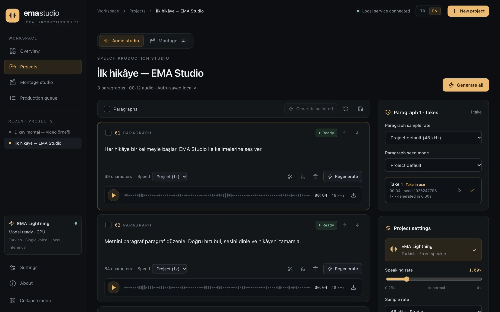

<div align="center">

# EMA Studio

**A local production studio for [EMA Lightning](https://huggingface.co/canberkkkkkk/ema-lightning), the Turkish text-to-speech model.**

Voice long texts paragraph by paragraph, keep every take, export WAV/ZIP and build a simple montage with images and video into an MP4 — all on your own computer.

[Türkçe README](README.tr.md) · [Architecture](docs/ARCHITECTURE.md) · [Development](docs/DEVELOPMENT.md) · [Contributing](CONTRIBUTING.md)

**Repository:** <https://github.com/serkan-uslu/ema-lightning-ui> · **Website source:** <https://github.com/serkan-uslu/ema-studio-site>

</div>

<p align="center">
  
</p>

> [!NOTE]
> EMA Studio is an independent community project built **for** EMA Lightning. The model is created by **Canberk Aslan** ([@canberkkkkkk](https://huggingface.co/canberkkkkkk)) and released under Apache 2.0. See [Acknowledgements](#acknowledgements).

## Features

- **Projects and paragraphs** — paste text or import UTF-8 `.txt`; blank lines become paragraphs. Add, split at the cursor, merge, reorder and delete.
- **Per-paragraph control** — project defaults with paragraph overrides for speaking rate (0.25–4×), random/fixed seed and 48/24/16/8 kHz output.
- **Background queue** — generate all, selected or out-of-date paragraphs; pause/resume, cancel queued jobs, retry failed or interrupted ones.
- **Takes** — every generation is kept with its text/settings snapshot. Pick the take you want; changed text or settings mark old audio as out of date.
- **One shared player** — paragraph cards, the take list, the montage library and the bottom player bar all drive the same playback, with click-to-seek waveforms.
- **Export** — single WAV per paragraph, ZIP of selected takes, or one combined WAV resampled to a common rate with adjustable gaps.
- **Montage studio** — one voice track and one visual track; move, trim, split, zoom, volume and fit; 16:9 or 9:16 live preview; local 1080p/30 fps H.264 + AAC render.
- **Local and private** — SQLite and files on disk, no account, no API key. Text, audio and media never leave the machine.
- **Interface** — Turkish and English UI, collapsible icon sidebar, responsive layout.

The model itself is Turkish-only with a single speaker; voice cloning and emotion control are not available.

## Requirements

| Requirement    | Version / note                                                                                          |
| -------------- | ------------------------------------------------------------------------------------------------------- |
| Node.js        | 20.9 or newer (22 LTS recommended)                                                                      |
| Python         | 3.11–3.13 (3.11 recommended)                                                                            |
| Package tools  | npm and [uv](https://docs.astral.sh/uv/getting-started/installation/)                                   |
| Video tools    | FFmpeg and ffprobe on `PATH`                                                                            |
| Render browser | Chrome for Testing, installed by `npm run setup:browser`                                                |
| GPU            | Not required; inference runs on CPU by default                                                          |
| Internet       | Needed once for dependencies, model weights and the render browser                                      |
| RAM / disk     | A numeric minimum RAM has not been measured. Reserve a few GB of disk for Node/PyTorch/browser + media. |

Verified end to end on macOS (Apple Silicon, CPU inference). Linux and Windows code paths exist but were not tested end to end. CUDA is optional and untested here; Apple MPS is not used.

## Quick start

```bash
npm ci
cd backend && uv sync --python 3.11 --frozen && cd ..
npm run setup:browser
npm run dev
```

Open <http://localhost:3000>. `npm run dev` starts Next.js on port 3000 and FastAPI on port 8010 (both bound to `127.0.0.1`); Ctrl+C stops both. On first launch the model weights are downloaded from Hugging Face and the sidebar shows the model status.

On macOS, install FFmpeg with `brew install ffmpeg` if needed.

## Usage

1. **Create a project**, paste text or upload a `.txt` file.
2. **Set defaults** (speed, sample rate, seed) in the project panel; override per paragraph when needed.
3. **Generate** all, selected or out-of-date paragraphs and follow progress in the queue.
4. **Listen and choose** — click a paragraph to see its takes, play them and pick the one to use.
5. **Export** a combined WAV or a ZIP, or switch to the **Montage** tab.
6. **Montage** — add selected takes in order, upload PNG/JPEG or H.264/AAC MP4, arrange on the timeline, then **Render MP4** and download it.

## Data, backup and offline use

All data lives in `data/` inside the repository (override with `EMA_DATA_DIR`):

```text
data/
  studio.sqlite3   # projects, paragraphs, takes, media, jobs
  audio/           # immutable WAV takes
  media/           # uploaded images and videos
  renders/         # MP4 outputs
  manifests/       # render snapshots and logs
```

To back up, stop the services and copy the **whole** `data/` folder (including any SQLite WAL/SHM files). The Hugging Face cache lives in `~/.cache/huggingface/hub` (`HF_HOME` changes it); the render browser lives in `node_modules/.remotion/`.

After the first download you can run offline:

```bash
HF_HUB_OFFLINE=1 NEXT_TELEMETRY_DISABLED=1 npm run dev
```

With this setting the model loaded from cache and produced real audio, and two MP4 renders completed with local files. A physical network disconnect was not tested.

| Variable          | Purpose                                                 |
| ----------------- | ------------------------------------------------------- |
| `EMA_DATA_DIR`    | Absolute path for the data folder                       |
| `EMA_DEVICE`      | `cpu` (default) or `cuda` (untested)                    |
| `EMA_BACKEND_URL` | Backend URL used by the Next.js proxy                   |
| `EMA_NODE_BINARY` | Node executable for the renderer (set by `npm run dev`) |

This app is designed for a single local user. It has no authentication and must not be exposed to the internet.

## Limits

- Images: PNG/JPEG. Video: H.264 MP4 with optional AAC audio, max 300 MB per file.
- Montage up to 2 hours and 500 clips; clips on the same track cannot overlap; every clip is at least one frame (1/30 s).
- Jobs run one at a time; pausing waits for the running job.
- Retrying a job reuses its original snapshot.
- No effects, keyframes, multi-layer compositing, automatic subtitles or live streaming.

## Troubleshooting

- **Service not connected** — check the `npm run dev` terminal and that ports 3000/8010 are free.
- **Model error** — the first download needs internet; drop `HF_HUB_OFFLINE=1` if the cache is missing; use `EMA_DEVICE=cpu`.
- **Video rejected** — check `ffprobe -version`; convert with `ffmpeg -i input.mov -c:v libx264 -c:a aac output.mp4`.
- **Render failed** — run `npm run setup:browser`; details are in `data/manifests/<job-id>.log`.

## Development

```bash
npm run check          # typecheck + ESLint + Prettier check
npm run build          # production build
npm run test:backend   # pytest suite
```

A Husky pre-commit hook runs lint-staged (ESLint + Prettier on staged files). See [docs/DEVELOPMENT.md](docs/DEVELOPMENT.md) for the workflow and [docs/ARCHITECTURE.md](docs/ARCHITECTURE.md) for the service → control → UI layering and the atomic component structure. Translations are described in [docs/I18N.md](docs/I18N.md) and the HTTP API in [docs/API.md](docs/API.md).

## Acknowledgements

This project exists because of **EMA Lightning** by **Canberk Aslan** — a tiny (8.6M parameters), fast Turkish text-to-speech model released openly under Apache 2.0. Thank you for sharing it with the community.

- Model card: <https://huggingface.co/canberkkkkkk/ema-lightning>
- Model source: <https://github.com/canberk7/ema-lightning>
- Python package: <https://pypi.org/project/ema-lightning/>
- Turkish text normalization: [normalizer-tr](https://github.com/erdemtuna/normalizer-tr) by Erdem Tuna

If you use EMA Lightning in your work, please cite it as the author suggests:

```bibtex
@misc{aslan2026emalightning,
  title        = {EMA Lightning: Tiny, Fast and Accurate Turkish Text to Speech},
  author       = {Aslan, Canberk},
  year         = {2026},
  howpublished = {\url{https://huggingface.co/canberkkkkkk/ema-lightning}}
}
```

Performance figures on the model card are the author's measurements, not measurements made by this project.

Built with Next.js, React, FastAPI, PyTorch, Remotion and lucide-react.

## License

EMA Studio is released under the [Apache License 2.0](LICENSE) — the same license as EMA Lightning. See [NOTICE](NOTICE) for attribution. The model's code and weights are not part of this repository; they are installed separately and remain under their own Apache 2.0 license. Remotion has its [own license](https://www.remotion.dev/license) — individuals and small teams are covered by the free license; review it for your organisation. Dependencies keep their own licenses.
