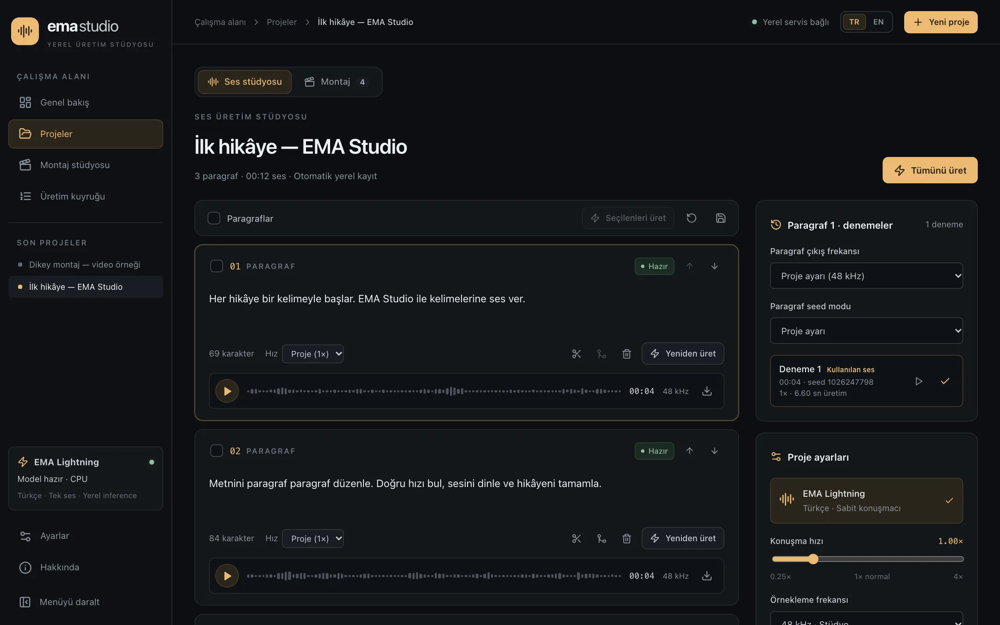

<div align="center">

# EMA Studio

**Türkçe metin-konuşma modeli [EMA Lightning](https://huggingface.co/canberkkkkkk/ema-lightning) için yerel üretim stüdyosu.**

Uzun metinleri paragraf paragraf seslendir, her denemeyi sakla, WAV/ZIP dışa aktar ve görsel/videolarla basit bir montaj yapıp MP4 al — tamamen kendi bilgisayarında.

[English README](README.md) · [Mimari](docs/ARCHITECTURE.md) · [Geliştirme](docs/DEVELOPMENT.md) · [Katkı](CONTRIBUTING.md)

**Depo:** <https://github.com/serkan-uslu/ema-lightning-ui> · **Tanıtım sitesi kaynağı:** <https://github.com/serkan-uslu/ema-studio-site>

</div>

<p align="center">
  
</p>

> [!NOTE]
> EMA Studio, EMA Lightning **için** geliştirilmiş bağımsız bir topluluk projesidir. Model **Canberk Aslan** ([@canberkkkkkk](https://huggingface.co/canberkkkkkk)) tarafından geliştirildi ve Apache 2.0 lisansıyla yayımlandı. Bkz. [Teşekkürler](#teşekkürler).

## Özellikler

- **Proje ve paragraflar** — metin yapıştır veya UTF-8 `.txt` yükle; boş satırlar paragraf olur. Ekle, imleçten böl, birleştir, sırala, sil.
- **Paragraf bazında kontrol** — proje varsayılanları ve paragraf override'ları: hız (0.25–4×), rastgele/sabit seed, 48/24/16/8 kHz.
- **Arka plan kuyruğu** — tümünü, seçilenleri veya güncel olmayanları üret; duraklat/devam et, bekleyeni iptal et, hatalıyı yeniden dene.
- **Ses denemeleri** — her üretim metin/ayar snapshot'ıyla saklanır; kullanılacak sürümü seç. Metin/ayar değişince eski ses "güncel değil" olarak işaretlenir.
- **Tek ortak oynatıcı** — paragraf kartları, deneme listesi, montaj kütüphanesi ve alt oynatıcı aynı oynatma durumunu paylaşır; dalga formuna tıklayarak sarabilirsin.
- **Dışa aktarma** — paragraf WAV, seçili denemelerin ZIP'i veya ortak frekansta, ayarlanabilir aralıklarla birleşik WAV.
- **Montaj stüdyosu** — bir anlatım ve bir görsel kanal; taşı, kırp, böl, yakınlaştır, ses seviyesi ve sığdırma; 16:9/9:16 canlı önizleme; yerel 1080p/30 fps H.264 + AAC render.
- **Yerel ve gizli** — SQLite ve diskteki dosyalar; hesap ve API anahtarı yok.
- **Arayüz** — Türkçe/İngilizce dil seçimi, ikon haline küçülebilen kenar menüsü, duyarlı düzen.

Model yalnızca Türkçe ve tek konuşmacılıdır; ses klonlama ve duygu kontrolü yoktur.

## Gereksinimler

| Gereksinim        | Sürüm / not                                                                             |
| ----------------- | --------------------------------------------------------------------------------------- |
| Node.js           | 20.9 veya üzeri (22 LTS önerilir)                                                       |
| Python            | 3.11–3.13 (3.11 önerilir)                                                               |
| Paket araçları    | npm ve [uv](https://docs.astral.sh/uv/getting-started/installation/)                    |
| Video araçları    | PATH içinde FFmpeg ve ffprobe                                                           |
| Render tarayıcısı | `npm run setup:browser` ile indirilen Chrome for Testing                                |
| GPU               | Gerekmez; varsayılan inference CPU                                                      |
| İnternet          | İlk kurulumda bağımlılık, model ve tarayıcı indirmesi için                              |
| RAM / disk        | Sayısal minimum RAM ölçülmedi. Node/PyTorch/tarayıcı ve medya için birkaç GB disk ayır. |

macOS Apple Silicon (CPU) üzerinde uçtan uca doğrulandı. Linux/Windows kod yolları var ama uçtan uca test edilmedi. CUDA isteğe bağlı ve burada test edilmedi; Apple MPS kullanılmaz.

## Hızlı başlangıç

```bash
npm ci
cd backend && uv sync --python 3.11 --frozen && cd ..
npm run setup:browser
npm run dev
```

<http://localhost:3000> adresini aç. `npm run dev`, Next.js'i 3000 ve FastAPI'yi 8010 portunda (`127.0.0.1`) birlikte başlatır; Ctrl+C ikisini de kapatır. İlk açılışta model ağırlıkları Hugging Face'ten indirilir.

## Kullanım

1. **Proje oluştur**, metni yapıştır veya `.txt` yükle.
2. Proje panelinden **varsayılanları** (hız, frekans, seed) belirle; gerekirse paragraf bazında değiştir.
3. Tümünü, seçilenleri veya güncel olmayanları **üret**; ilerlemeyi kuyrukta izle.
4. Bir paragrafa tıklayıp **denemelerini dinle** ve kullanılacak sesi seç.
5. Birleşik WAV veya ZIP **dışa aktar** ya da **Montaj** sekmesine geç.
6. **Montajda** seçili sesleri sırayla ekle, PNG/JPEG veya H.264/AAC MP4 yükle, timeline'da düzenle, **MP4 render** al ve indir.

## Veri, yedekleme ve çevrimdışı kullanım

Veriler depo içindeki `data/` klasöründedir (`EMA_DATA_DIR` ile değiştirilebilir). Yedek için servisleri kapatıp `data/` klasörünün **tamamını** (SQLite WAL/SHM dahil) kopyala. Model önbelleği `~/.cache/huggingface/hub`, render tarayıcısı `node_modules/.remotion/` altındadır.

İlk indirmeden sonra:

```bash
HF_HUB_OFFLINE=1 NEXT_TELEMETRY_DISABLED=1 npm run dev
```

Bu ayarla model önbellekten yüklenip gerçek ses üretti ve yerel dosyalarla iki MP4 render tamamlandı. Fiziksel ağ kesintisiyle test yapılmadı.

Uygulama tek yerel kullanıcı içindir; kimlik doğrulama yoktur, internete açılmamalıdır.

## Sınırlar

- Görsel PNG/JPEG; video H.264 MP4 (varsa AAC ses), dosya başına en fazla 300 MB.
- Montaj en fazla 2 saat ve 500 klip; aynı kanalda klipler çakışamaz.
- İşler sırayla çalışır; duraklatma çalışan işin bitmesini bekler. Yeniden deneme orijinal snapshot'ı kullanır.
- Efekt, keyframe, çok katman, otomatik altyazı ve canlı streaming yoktur.

## Sorun giderme

- **Servis bağlı değil** — `npm run dev` terminalini ve 3000/8010 portlarını kontrol et.
- **Model hatası** — ilk indirme internet ister; önbellek yoksa `HF_HUB_OFFLINE=1` olmadan çalıştır.
- **Video kabul edilmiyor** — `ffmpeg -i input.mov -c:v libx264 -c:a aac output.mp4` ile dönüştür.
- **Render hatası** — `npm run setup:browser` çalıştır; ayrıntılar `data/manifests/<job-id>.log` içinde.

## Geliştirme

```bash
npm run check          # typecheck + ESLint + Prettier kontrolü
npm run build          # üretim derlemesi
npm run test:backend   # pytest (13 test)
```

Husky pre-commit kancası lint-staged ile stage'lenen dosyalarda ESLint ve Prettier çalıştırır. Ayrıntılar: [docs/DEVELOPMENT.md](docs/DEVELOPMENT.md), [docs/ARCHITECTURE.md](docs/ARCHITECTURE.md), [docs/I18N.md](docs/I18N.md), [docs/API.md](docs/API.md).

## Teşekkürler

Bu proje, **Canberk Aslan**'ın geliştirdiği **EMA Lightning** sayesinde var: Apache 2.0 ile açıkça paylaşılan küçük (8.6M parametre) ve hızlı bir Türkçe metin-konuşma modeli. Modeli toplulukla paylaştığı için içtenlikle teşekkür ederiz.

- Model kartı: <https://huggingface.co/canberkkkkkk/ema-lightning>
- Model kaynak kodu: <https://github.com/canberk7/ema-lightning>
- Python paketi: <https://pypi.org/project/ema-lightning/>
- Türkçe metin normalizasyonu: Erdem Tuna'nın [normalizer-tr](https://github.com/erdemtuna/normalizer-tr) projesi

Çalışmanda EMA Lightning kullanıyorsan model yazarının önerdiği atıfı kullan:

```bibtex
@misc{aslan2026emalightning,
  title        = {EMA Lightning: Tiny, Fast and Accurate Turkish Text to Speech},
  author       = {Aslan, Canberk},
  year         = {2026},
  howpublished = {\url{https://huggingface.co/canberkkkkkk/ema-lightning}}
}
```

Model kartındaki performans değerleri yazarın ölçümleridir; bu projede ölçülmemiştir.

## Lisans

EMA Studio, EMA Lightning ile aynı lisans olan [Apache License 2.0](LICENSE) ile yayımlanır. Atıf için [NOTICE](NOTICE) dosyasına bakın. Modelin kodu ve ağırlıkları bu depoda bulunmaz; ayrıca kurulur ve kendi Apache 2.0 lisanslarına tabidir. Remotion'un [kendi lisansı](https://www.remotion.dev/license) geçerlidir. Bağımlılıklar kendi lisanslarını korur.
